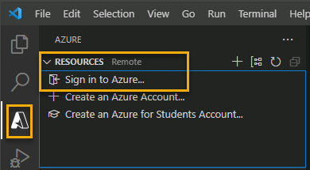

---
lab:
  topic: Azure Functions
  title: 使用 Visual Studio Code 创建 Azure 函数
  description: 了解如何通过 HTTP 触发器创建 Azure 函数。 在 Visual Studio Code 中创建代码并在本地测试后，将函数部署到 Azure。
---

# 使用 Visual Studio Code 创建 Azure 函数

在本练习中，你将学习如何创建一个 C\# 函数，以响应 HTTP 请求。 在 Visual Studio Code 中创建代码并在本地测试后，在 Azure 中部署和测试函数。

在本练习中执行的任务：

* 创建本地项目
* 在本地运行函数
* 在 Azure 中部署和执行函数
* 清理资源

此练习大约需要 15 分钟才能完成****。

## 开始之前

要完成此练习，需要满足以下先决条件：

* Azure 订阅。 如果你还没有，可以[注册一个](https://azure.microsoft.com/)。

* 安装在某个[受支持的平台](https://code.visualstudio.com/docs/supporting/requirements#_platforms)上的 [Visual Studio Code](https://code.visualstudio.com/)。

* [.NET 8](https://dotnet.microsoft.com/en-us/download/dotnet/8.0) 是目标框架。

* 适用于 Visual Studio Code 的 [C# 开发工具包](https://marketplace.visualstudio.com/items?itemName=ms-dotnettools.csdevkit)。

* 适用于 Visual Studio Code 的 [Azure Functions 扩展](https://marketplace.visualstudio.com/items?itemName=ms-azuretools.vscode-azurefunctions)。

* Azure Functions Core Tools 版本 4.x。 在终端运行以下命令，在系统上安装 Azure Functions Core Tools。 请访问 [GitHub 上的 Azure Function Core Tools](https://github.com/Azure/azure-functions-core-tools?tab=readme-ov-file#installing)，获取其他平台上的安装说明。

    ```
    winget uninstall Microsoft.Azure.FunctionsCoreTools
    winget install Microsoft.Azure.FunctionsCoreTools
    ```

    如果在安装 Azure Function Core Tools 时遇到任何错误，请根据错误代码搜索解决方案。 然后重试上一步中的 winget install 命令****。

## 创建本地项目

在本部分，你将使用 Visual Studio Code 在 C# 中创建一个本地 Azure Functions 项目。 在此练习的后面，会将函数代码发布到 Azure。

1. 在 Visual Studio Code 中，按 F1 打开命令面板，然后搜索并运行命令“Azure Functions:**** 创建新项目...”。

1. 为项目工作区选择目录位置，然后选择“选择”****。 你应当为项目工作区创建一个新文件夹或选择一个空文件夹。 不要选择已是某个工作区的一部分的项目文件夹。

1. 根据提示提供以下信息：

    | 提示 | 操作 |
    |--|--|
    | 选择将包含函数项目的文件夹 | 选择“浏览...”，为应用选择文件夹****。
    | 选择一种语言 | 选择“C#”。**** |
    | 选择 .NET 运行时 | 选择“**.NET 8.0 隔离版**” |
    | 为项目的第一个函数选择模板 | 选择“**HTTP 触发器**”。<sup>1</sup> |
    | 提供函数名称 | 输入 `HttpExample`。 |
    | 提供命名空间 | 输入 `My.Function`。 |
    | 授权级别 | 选择“**匿名**”，这样任何人都可以调用你的函数终结点。 |

    <sup>1</sup> 根据 VS Code 设置，你可能需要使用“**更改模板筛选器**”选项来查看完整的模板列表。

1. Visual Studio Code 将使用提供的信息生成一个包含 HTTP 触发器的 Azure Functions 项目。 可以在资源管理器中查看本地项目文件。

    > **注意**：如果 VS Code 显示带有标题为“是否信任此文件夹中文件的作者?”的弹出窗口，请选择“是，我信任作者”按钮********。

### 在本地运行函数

Visual Studio Code 与 Azure Functions Core Tools 相集成，便于你在发布到 Azure 之前在本地开发计算机上运行此项目。

1. 请确保在 Visual Studio Code 中打开终端。 可以通过选择“终端”，然后在菜单栏中选择“新建终端”来打开终端。 

1. 按 F5 在调试程序中启动函数应用项目。 来自 Core Tools 的输出会显示在“终端”  面板中。 应用将在“终端”面板中启动。 可以看到 HTTP 触发函数的 URL 终结点在本地运行。

    

1. 运行 Core Tools 时，打开 Azure 扩展****。 在扩展的“工作区”部分，展开“本地项目” > “Functions”************。 右键单击 **HttpExample** 函数并选择“**立即执行函数...**”

    

1. 在“输入请求正文”中键入请求消息正文值 `{ "name": "Azure" }`。 按 **Enter** 将此请求消息发送给函数。 当函数在本地执行并返回响应时，Visual Studio Code 中将引发通知。

    选择通知铃图标来查看通知。 函数执行的相关信息将显示在“终端”面板中。

1. 按 Shift + F5 停止 Core Tools 并断开调试程序。

确认该函数可以在本地计算机上正确运行以后，可以使用 Visual Studio Code 将项目直接发布到 Azure。

## 在 Azure 中部署和执行函数

在本部分中，你将创建一个 Azure 函数应用资源并将该函数部署到资源。

### 登录 Azure

在发布应用之前，必须先登录到 Azure。 如果已登录，请转到下一部分。

1. 如果你尚未登录，请在活动栏中选择“Azure”图标，然后在“Azure: 函数”**资源”区域中，选择“登录到 Azure…”******。

    

1. 在浏览器中出现提示时，请选择你的 Azure 帐户，并使用你的 Azure 帐户凭据登录。

1. 成功登录后，可以关闭新浏览器窗口。 属于你的 Azure 帐户的订阅显示在边栏中。

### 在 Azure 中创建资源

在本部分中，将创建部署本地函数应用所需的 Azure 资源。

1. 在活动栏中选择“Azure”图标，然后在“资源”区域中选择“创建资源…”按钮。

        

1. 根据提示提供以下信息：

    | 提示 | 操作 |
    |--|--|
    | 选择要创建的资源 | 选择“在 Azure 中创建函数应用…” |
    | 选择订阅 | 选择要使用的订阅。 *如果只有一个订阅，则不会看到此项。* |
    | 输入函数应用的全局唯一名称 | 键入在 URL 路径中有效的名称，例如 `myfunctionapp`。 你键入的名称将经过验证，以确保它是唯一的。 |
    | 选择新资源的位置 | 为了获得更好的性能，请选择你附近的区域。 |
    | 选择一个运行时堆栈 | 选择“**.NET 8.0 隔离版**”。 |
    | 选择资源身份验证类型 | 选择“机密”**** |

    在创建各项资源时，扩展会在终端窗口的 **AZURE** 区域中显示这些单个资源的状态。
    
1. 完成后，将使用基于函数应用名称的名称在订阅中创建以下 Azure 资源：

    * 一个资源组：相关资源的逻辑容器。
    * 一个标准 Azure 存储帐户：用于维护项目的状态和其他信息。
    * Flex 消耗计划，用于定义无服务器函数应用的基础主机。
    * 一个函数应用：提供用于执行函数代码的环境。 可以通过函数应用将函数分组为逻辑单元，以便在同一托管计划中更轻松地管理、部署和共享资源。
    * 一个连接到函数应用的 Application Insights 实例：用于跟踪无服务器函数的使用情况。

### 将项目部署到 Azure

> **！重要：** 发布到现有函数会覆盖之前的任何部署。

1. 在命令面板中，搜索并运行命令“**Azure Functions: 部署到函数应用...**”。

1. 选择用于创建资源的订阅。

1. 选择你创建的函数应用。 当系统提示覆盖以前的部署时，请选择“部署”，将函数代码部署到新的函数应用资源。****

1. 部署完成后，选择“**查看输出**”以查看部署结果的详细信息。 如果错过了通知，请选择右下角的通知铃图标再次查看。

    

### 在 Azure 中运行函数

1. 返回侧边栏中的“资源”区域，展开订阅、新函数应用和“函数”。 **右键单击** **HttpExample** 函数并选择“**立即执行函数...**”。

    

1. 在“输入请求正文”中，你将看到请求消息正文值 `{ "name": "Azure" }`****。 按 Enter 将此请求消息发送给函数。

1. 当函数在 Azure 中执行并返回响应时，Visual Studio Code 中将引发通知。 选择通知铃图标来查看通知。

## 清理资源

完成练习后，应删除已创建的云资源，以避免不必要的资源使用。

1. 在浏览器中，导航到 Azure 门户，网址为：[https://portal.azure.com](https://portal.azure.com)；如果出现提示，请使用 Azure 凭据登录。
1. 导航到创建的资源组，然后查看本练习中使用的资源内容。
1. 在工具栏中，选择“删除资源组”****。
1. 输入资源组名称，并确认要删除该资源组。

> 注意：**** 删除资源组会删除其中包含的所有资源。 如果你为本练习选择了一个现有资源组，则该资源组中超出本练习范围的任何现有资源也将被一并删除。
